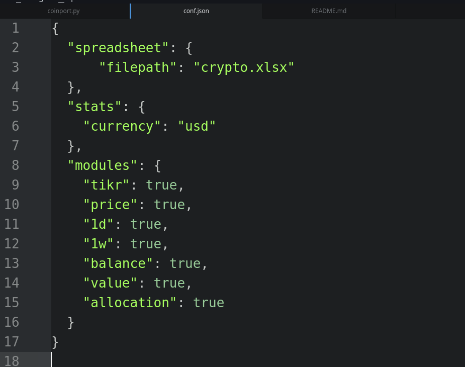
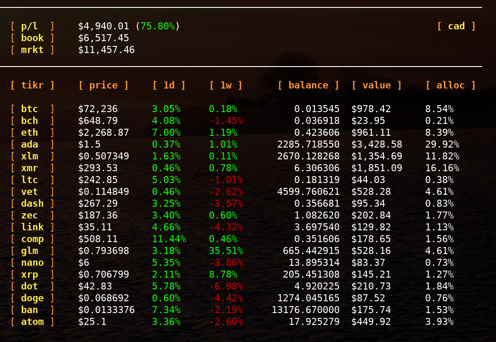

# coinport
A minimalist cryptocurrency & portfolio tracker written in Python using the CoinGecko API.

## Requirements

**Python**

This is a Python script, so make sure you have Python installed. This was tested with Python 3.9 in Linux, Mac and Windows.

Depending on your environment, you may need to run the commands below using `python3` instead of `python`, or `pip3` instead of `pip`.

**Virtual Environment & Dependencies**

It is a good practice to do this within a virtual environment.

First git clone the repo:

`git clone https://codeberg.org/gomarcd/coinport`

Change into the directory:

`cd coinport`

Make sure you have `venv` installed:

`sudo apt install python-venv`

Create a virtual environment:

`python -m venv venv`

Activate it:

`source venv/bin/activate`

Now install the dependencies:

`pip install -r requirements.txt`

## Windows

Some Windows 11 users have experienced `.deleteme logic` and permissions errors. To avoid this, launch your terminal with *Run as Administrator* before following the steps, and be sure to do `python -m pip install --upgrade pip`, then install the dependencies.

## Usage

LibreOffice and MS Office formats are supported. By default, the script will look for the included file, `crypto.xlsx`. You can point it to your file of choice by editing `conf.json`.

When adding or removing coins from the spreadsheet, be sure to use the cryptocurrency **name** (ie, "Bitcoin", "Monero", etc). The **ticker/symbol** is not used here because there are duplicates in Coingecko. You may also specify the currency to display the prices in (ie: USD) and add/remove columns in the conf file:

From the directory you cloned into, run the script:

`python coinport.py`

The script will refresh automatically. To stop the script, press `CTRL-C` or close the terminal window.

